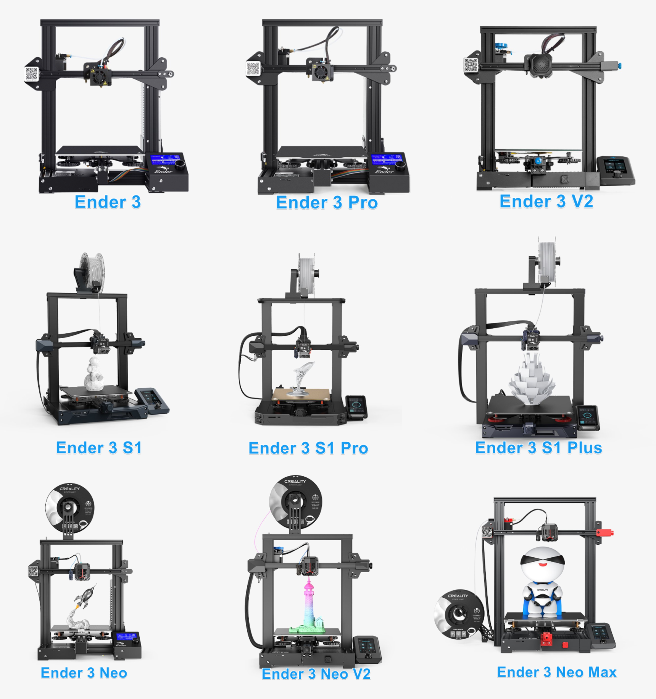

# Hardware Overview

The core hardware needed to convert your Ender 3 (or Ender 3 Pro) into a desktop CNC machine can be different based on which printer you are starting with, or if you are starting with no printer at all. Parts are broken into reused components, items to purchase, and optional upgrades. Wherever possible, the BOM is aligned with common Voron 3D printer parts to make sourcing easier for hobbyists. The BOM for each build has been moved to the individual model section you are planning on building.

## Reused Ender 3 Parts

* **Frame & Structural Components** – keep most of the original aluminum extrusions and screws.
* **Electronics** - Original V1 and V4 MCU's have been tested.
* **Motors & Wiring** – stepper motors, wiring harnesses, and couplers.
* **Limit switches** – reuse up to 3, but you’ll need at least 1 additional switch.
* **Belts & Bearings** – 2 belts can be reused; plan to buy extra. Use existing bearings.
* **Fasteners** – most M3, M4, and M5 nuts and bolts can be salvaged.

!!! Note
    Modifications such as cutting the top 2020 extrusion for the z-axis require careful measurement.

## Differences between Ender 3 printers

Before diving in there a few key differences between versions of Ender 3 3D printers and are worth noting. This may affect your decision if you are looking at models for this project.

* Ender 3 and Ender 3 pro are essentially the same for the CNC conversion, the most significant difference is the extrusion used for the gantry (the Y extrusion that the Bed rides on).
* The rest of Ender 3 models are not covered here as they have not been tested but are here for awareness, they may or may not be suitable.

### Differences

| Part                     | Ender 3  | Ender 3 Pro             | CNC Implication                                                 |
| ------------------------ | -------- | ----------------------- | --------------------------------------------------------------- |
| Y-axis plate Extrusion   | 2040     | 4040                    | Gantry needs a 300mm extrusion purchased if original Ender 3    |
| V-wheels / rollers       | Plastic  | Slightly higher quality | CNC conversion uses same wheels but alignment becomes critical. |
| Screws & T-nuts          | Standard | Some upgraded           | Reuse as much as possible; minor differences.                   |
| Electronics              | V1.1.x   | V4.2.x                  | The Pro version is a better MCU                                 |

!!! note
    There is a mod to utilize the 2040 v-slot 300m gantry extrusion on the non pro but we do not recommend it. We recommend buying 2x 2040 v-slot 300m extrusions for $12 and fabricating the 4040 that the pro comes with and is explained in the gantry section.

---

## Self sourcing 

!!! warning
    If you can't find a reasonable priced Ender 3 you can self source the parts from the jungle store.

This is to give you an idea of the cost if you were to build your own classic Ender 3 printer. It does not include all the parts that came with the original Ender, it is just a ballpark figure for people interested. When buying it is cheaper to buy in quantity to save money so our example here is for two printers.

**Cost for profiles:**

- 2020 profiles - 330 + 345 = 675 mm [Amazon $18](https://www.amazon.com/Seekliny-Aluminum-Extrusion-V-Slotted-Accessories/dp/B0DY7D8B23) 2 extra
- 2040 profiles - 330 + 400 + 400 = 1,130 mm [Amazon $18](https://www.amazon.com/400mm-Aluminum-Extrusion-European-Standard/dp/B0DST7TW3Z) 0 extra so buy 2 $36
- 4040 profiles - 250 + 290 + 290 = 830 mm [Amazon $55 4x600mm](https://www.amazon.com/Aluminum-Extrusion-European-Standard-Anodized/dp/B09MYGZDW4)  cut to appropriate length enough for 2

**Two frames total = $109/2 or $55 each**

**Other essential parts**

- Power supply [Amazon $22](https://www.amazon.com/SHNITPWR-Switching-Converter-Transformer-Security/dp/B07TWW8Q73) x2
- 42-34 Motor [Amazon $27](https://www.amazon.com/YEJMKJ-Stepper-41-07oz%C2%B7-Bipolar-Printer/dp/B0FHHV9JZG) x2
- 42-40 Motor [Amazon $22](https://www.amazon.com/Printer-Stepper-42-40-Extruder-Creality/dp/B0CSW9KG8H) 1 each

**Total for 2 (frame/motor/power) = $229 (add 2x$50 electronics) or about $170 each**

---

## Ready to Proceed?

Once you have the required parts, continue to the next section to review required printed parts.

  <a href="/EnderCNCs/printed_parts" class="md-button md-button--primary">
    Continue to Printed Parts →
  </a>

