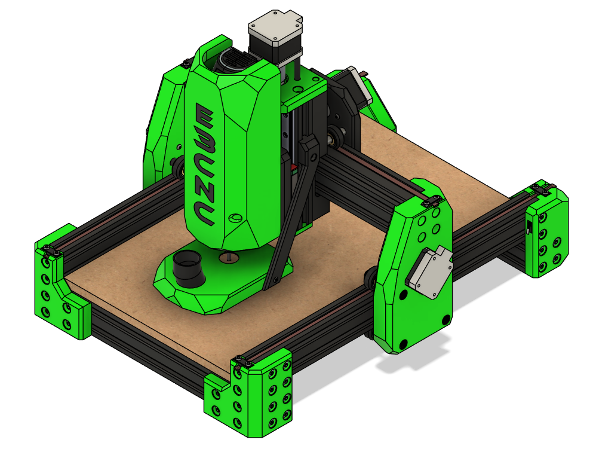

# Ender 3 CNCs Build Manual

  

!!! note "Work in Progress"
    This project is under active development. Revisions, refinements, and corrections are ongoing. Contributions are always welcome! 
    
    If you spot an issue, feel free to [open an issue](https://github.com/Futtawuh/EnderCNCs/issues) and let us know, or clone the repository and [submit a pull request](https://github.com/Futtawuh/EnderCNCs/pulls).

## Design Philosophy

This project is not about bolting a spindle onto a printer. It is built around these engineering priorities:

* **Maximum Reuse** - Retain as much of the original machine as possible — frame, motion components, electronics — to reduce cost and complexity. Save the planet!
* **Controlled Scalability** - Allow adaptation to custom frames or expanded builds without redesigning the entire system.
* **Modifications with reason** improved stiffness, reduced deflection, better load handling, or cleaner integration.

## Performance Snapshot

While this is still a developing platform, current test results demonstrate:

* Stable hardwood cutting
* Aluminum machining with conservative feeds
* Repeatable part production

The conversion reinforces primary load paths and implements independent dual Y-axis control, reducing racking, improving torsional resistance, and increasing positional stability under machining forces. Final performance depends on tool selection, feeds and speeds, spindle choice, and tuning quality.

*This is not an industrial [VMC](https://www.mechanicaleducation.com/difference-between-cnc-and-vmc/). It is a capable, budget-conscious desktop CNC system when built and configured properly.*

## Who This Project Is For

* Makers comfortable assembling mechanical systems
* 3D printer users familiar with firmware configuration
* Hobbyists looking for an accessible CNC entry point
* Builders who value reuse and system optimization
* Tinkerers who enjoy iterative improvement

## Who This Project Is Not For

* Users expecting plug-and-play CNC performance
* Production shops requiring industrial tolerances
* Builders unwilling to tune firmware or align mechanical systems
* Anyone uncomfortable with troubleshooting

This build rewards patience and mechanical understanding.

---

## The Basic Model

There are several models to choose from and we are working on getting information published as soon as we can.

Currently we are in progress of completing the build manual for the **Basic Model**. 

!!! success "Build Gallery"
    Examples of CNC's that users have built can be found in the [Gallery](Builds/gallery.md)

**Converting a Proven Motion Platform into a Precision CNC System**

The Ender 3 is a well-understood, mechanically consistent motion platform. Ender3CNC transforms it into a capable desktop CNC machine — not as a novelty conversion, but as a deliberate, mechanically considered upgrade. We want to save machines from the landfill and give them a new purpose.

This manual provides a structured, engineering-focused pathway to convert a standard Ender 3 (or Ender 3 Pro) into a rigid, repeatable CNC platform using:

* Documented design decisions
* Tested configurations

The result is a machine capable of cutting hardwood, plastics, and aluminum while maintaining affordability and accessibility.

---

## Control Architecture

Tested Reference configurations:

* Original Ender 3 MCU, and other aftermarket 3D printer MCU's with Klipper firmware
* Fusion 360 (free version), FreeCAD, or Kiri:moto for CAM
* Ubuntu laptop running Klipper (as Raspberry Pi substitute) as a Klipper Post proceesor

This configuration has proven stable during testing.

A GRBL workflow is also viable. Klipper was selected to reduce the learning curve for users transitioning from 3D printing and reuse existing electronics.

---

## Reused Components

The system intentionally retains:

* Frame (cutting required)
* Stepper motors
* Wiring (some extensions may be required)
* Leadscrew and nut (cutting required)
* Coupler
* MCU
* Power supply
* Most fasteners
* V-wheels
* Aluminum spacers
* LCD (optional)

The goal is not reinvention — it is optimization.

Complete details in the BOM.

---

## Ready to Proceed?

This manual will guide you through tools, parts, mechanical conversion, and configuration.

  <a href="tools" class="md-button md-button--primary">
    Begin with Required Tools →
  </a>

---

## Need to see the builds?

  <a href="Builds/gallery" class="md-button md-button--secondary">
    View the Build Gallery →
  </a>

!!! tip "Recommended Approach"
    Follow the chapters sequentially. Mechanical alignment, structural rigidity, and configuration steps build on one another.
